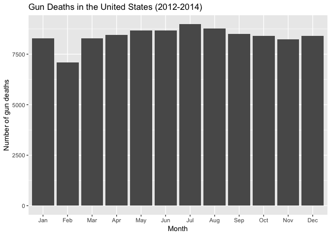
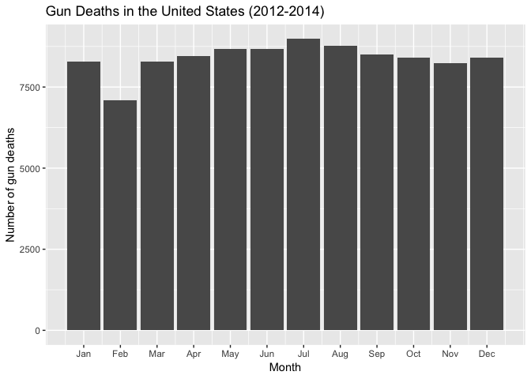
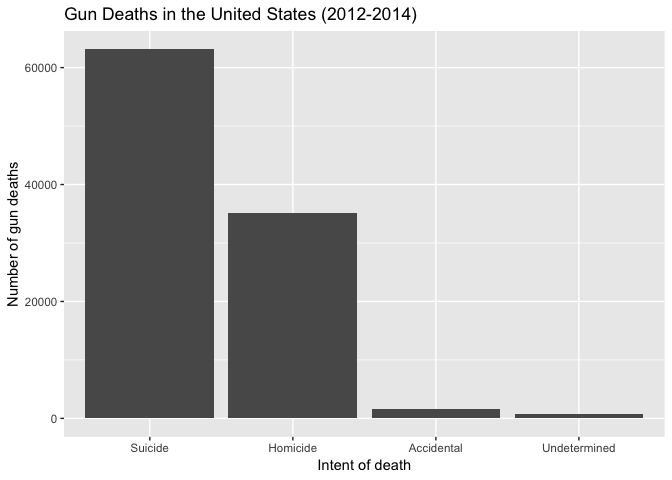
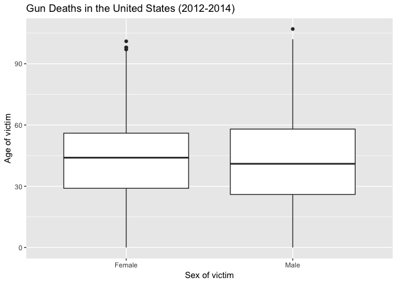
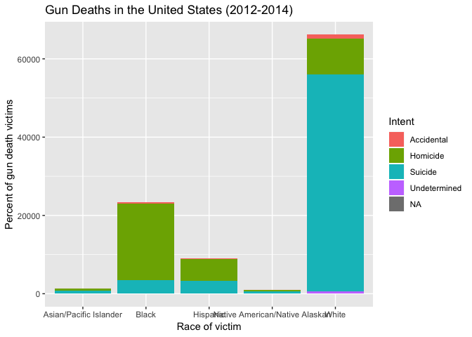
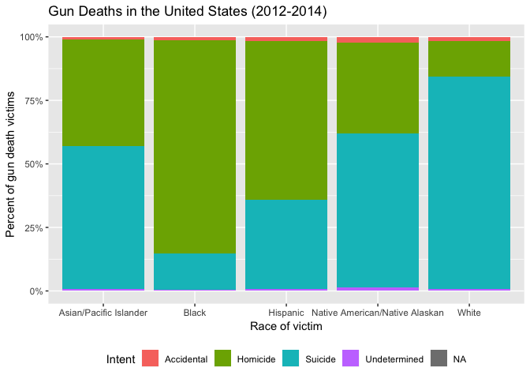
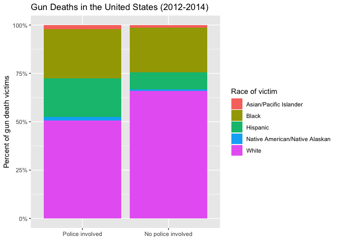
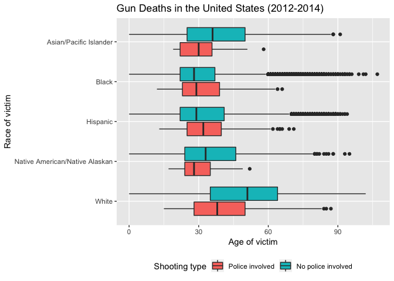
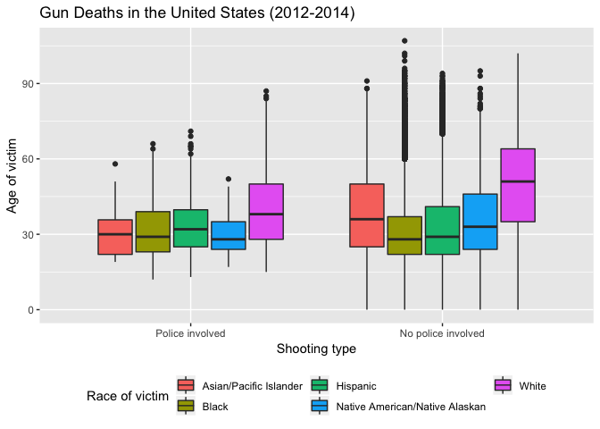

Exploring Gun Deaths in America
================
Benjamin Soltoff
October 10, 2018

Get the data
------------

``` r
library(tidyverse)    # load tidyverse packages, including ggplot2
```

    ## ── Attaching packages ───────────────────────────────────────────────────────── tidyverse 1.2.1 ──

    ## ✔ ggplot2 3.0.0     ✔ purrr   0.2.5
    ## ✔ tibble  1.4.2     ✔ dplyr   0.7.6
    ## ✔ tidyr   0.8.1     ✔ stringr 1.3.1
    ## ✔ readr   1.1.1     ✔ forcats 0.3.0

    ## ── Conflicts ──────────────────────────────────────────────────────────── tidyverse_conflicts() ──
    ## ✖ dplyr::filter() masks stats::filter()
    ## ✖ dplyr::lag()    masks stats::lag()

``` r
library(knitr)        # load functions for formatting tables

# get data from rcfss package
# install latest version if not already installed
# devtools::install_github("uc-cfss/rcfss")
library(rcfss)

# load the data
data("gun_deaths")
gun_deaths
```

    ## # A tibble: 100,798 x 10
    ##       id  year month intent  police sex     age race      place  education
    ##    <int> <int> <dbl> <chr>    <int> <chr> <int> <chr>     <chr>  <fct>    
    ##  1     1  2012     1 Suicide      0 M        34 Asian/Pa… Home   BA+      
    ##  2     2  2012     1 Suicide      0 F        21 White     Street Some col…
    ##  3     3  2012     1 Suicide      0 M        60 White     Other… BA+      
    ##  4     4  2012     2 Suicide      0 M        64 White     Home   BA+      
    ##  5     5  2012     2 Suicide      0 M        31 White     Other… HS/GED   
    ##  6     6  2012     2 Suicide      0 M        17 Native A… Home   Less tha…
    ##  7     7  2012     2 Undete…      0 M        48 White     Home   HS/GED   
    ##  8     8  2012     3 Suicide      0 M        41 Native A… Home   HS/GED   
    ##  9     9  2012     2 Accide…      0 M        50 White     Other… Some col…
    ## 10    10  2012     2 Suicide      0 M        NA Black     Home   <NA>     
    ## # ... with 100,788 more rows

Generate a data frame that summarizes the number of gun deaths per month.
-------------------------------------------------------------------------

### Print the data frame as a formatted `kable()` table.

|  Month|  Number of Deaths|
|------:|-----------------:|
|      1|              8273|
|      2|              7093|
|      3|              8289|
|      4|              8455|
|      5|              8669|
|      6|              8677|
|      7|              8989|
|      8|              8783|
|      9|              8508|
|     10|              8406|
|     11|              8243|
|     12|              8413|

### Generate a bar chart with human-readable labels on the x-axis. That is, each month should be labeled "Jan", "Feb", "Mar" (full or abbreviated month names are fine), not `1`, `2`, `3`.



Generate a bar chart that identifies the number of gun deaths associated with each type of intent cause of death. The bars should be sorted from highest to lowest values.
--------------------------------------------------------------------------------------------------------------------------------------------------------------------------



Generate a boxplot visualizing the age of gun death victims, by sex. Print the average age of female gun death victims.
-----------------------------------------------------------------------------------------------------------------------

    ## Warning: Removed 18 rows containing non-finite values (stat_boxplot).



    ## # A tibble: 1 x 1
    ##     age
    ##   <dbl>
    ## 1  43.7

How many white males with at least a high school education were killed by guns in 2012?
---------------------------------------------------------------------------------------

There were 15199 white males with at least a high school education killed by guns in 2012.

Which season of the year has the most gun deaths?
-------------------------------------------------

Assume that:

-   Winter = January-March
-   Spring = April-June
-   Summer = July-September
-   Fall = October-December

| Season |  Number of Deaths|
|:-------|-----------------:|
| Winter |             23655|
| Spring |             25801|
| Summer |             26280|
| Fall   |             25062|


Are whites who are killed by guns more likely to die because of suicide or homicide? How does this compare to blacks and hispanics?
===================================================================================================================================

An okay graph
-------------



A better graph
--------------



Are police-involved gun deaths significantly different from other gun deaths? Assess the relationship between police involvement and age, police involvement and race, and the intersection of all three variables.
-------------------------------------------------------------------------------------------------------------------------------------------------------------------------------------------------------------------

    ## # A tibble: 172 x 3
    ##    police            age     n
    ##    <fct>           <int> <int>
    ##  1 Police involved    12     1
    ##  2 Police involved    13     1
    ##  3 Police involved    14     1
    ##  4 Police involved    15     5
    ##  5 Police involved    16     7
    ##  6 Police involved    17    13
    ##  7 Police involved    18    24
    ##  8 Police involved    19    28
    ##  9 Police involved    20    34
    ## 10 Police involved    21    43
    ## # ... with 162 more rows

    ## Warning: Removed 18 rows containing non-finite values (stat_boxplot).


    ## # A tibble: 10 x 3
    ##    police             race                               n
    ##    <fct>              <chr>                          <int>
    ##  1 Police involved    Asian/Pacific Islander            30
    ##  2 Police involved    Black                            356
    ##  3 Police involved    Hispanic                         282
    ##  4 Police involved    Native American/Native Alaskan    25
    ##  5 Police involved    White                            709
    ##  6 No police involved Asian/Pacific Islander          1296
    ##  7 No police involved Black                          22940
    ##  8 No police involved Hispanic                        8740
    ##  9 No police involved Native American/Native Alaskan   892
    ## 10 No police involved White                          65528



    ## # A tibble: 671 x 4
    ##    police          race                     age     n
    ##    <fct>           <chr>                  <int> <int>
    ##  1 Police involved Asian/Pacific Islander    19     1
    ##  2 Police involved Asian/Pacific Islander    20     1
    ##  3 Police involved Asian/Pacific Islander    21     3
    ##  4 Police involved Asian/Pacific Islander    22     4
    ##  5 Police involved Asian/Pacific Islander    25     2
    ##  6 Police involved Asian/Pacific Islander    27     3
    ##  7 Police involved Asian/Pacific Islander    29     1
    ##  8 Police involved Asian/Pacific Islander    31     1
    ##  9 Police involved Asian/Pacific Islander    32     1
    ## 10 Police involved Asian/Pacific Islander    34     2
    ## # ... with 661 more rows

    ## Warning: Removed 18 rows containing non-finite values (stat_boxplot).



    ## Warning: Removed 18 rows containing non-finite values (stat_boxplot).



Session info
------------

``` r
devtools::session_info()
```

    ## Session info -------------------------------------------------------------

    ##  setting  value                       
    ##  version  R version 3.5.1 (2018-07-02)
    ##  system   x86_64, darwin15.6.0        
    ##  ui       X11                         
    ##  language (EN)                        
    ##  collate  en_US.UTF-8                 
    ##  tz       America/Chicago             
    ##  date     2018-09-25

    ## Packages -----------------------------------------------------------------

    ##  package    * version date       source        
    ##  assertthat   0.2.0   2017-04-11 CRAN (R 3.5.0)
    ##  backports    1.1.2   2017-12-13 CRAN (R 3.5.0)
    ##  base       * 3.5.1   2018-07-05 local         
    ##  bindr        0.1.1   2018-03-13 CRAN (R 3.5.0)
    ##  bindrcpp   * 0.2.2   2018-03-29 CRAN (R 3.5.0)
    ##  broom        0.5.0   2018-07-17 CRAN (R 3.5.0)
    ##  cellranger   1.1.0   2016-07-27 CRAN (R 3.5.0)
    ##  cli          1.0.0   2017-11-05 CRAN (R 3.5.0)
    ##  colorspace   1.3-2   2016-12-14 CRAN (R 3.5.0)
    ##  compiler     3.5.1   2018-07-05 local         
    ##  crayon       1.3.4   2017-09-16 CRAN (R 3.5.0)
    ##  datasets   * 3.5.1   2018-07-05 local         
    ##  devtools     1.13.6  2018-06-27 CRAN (R 3.5.0)
    ##  digest       0.6.15  2018-01-28 CRAN (R 3.5.0)
    ##  dplyr      * 0.7.6   2018-06-29 cran (@0.7.6) 
    ##  evaluate     0.11    2018-07-17 CRAN (R 3.5.0)
    ##  fansi        0.3.0   2018-08-13 CRAN (R 3.5.0)
    ##  forcats    * 0.3.0   2018-02-19 CRAN (R 3.5.0)
    ##  ggplot2    * 3.0.0   2018-07-03 CRAN (R 3.5.0)
    ##  glue         1.3.0   2018-07-17 CRAN (R 3.5.0)
    ##  graphics   * 3.5.1   2018-07-05 local         
    ##  grDevices  * 3.5.1   2018-07-05 local         
    ##  grid         3.5.1   2018-07-05 local         
    ##  gtable       0.2.0   2016-02-26 CRAN (R 3.5.0)
    ##  haven        1.1.2   2018-06-27 CRAN (R 3.5.0)
    ##  highr        0.7     2018-06-09 CRAN (R 3.5.0)
    ##  hms          0.4.2   2018-03-10 CRAN (R 3.5.0)
    ##  htmltools    0.3.6   2017-04-28 CRAN (R 3.5.0)
    ##  httr         1.3.1   2017-08-20 CRAN (R 3.5.0)
    ##  jsonlite     1.5     2017-06-01 CRAN (R 3.5.0)
    ##  knitr      * 1.20    2018-02-20 CRAN (R 3.5.0)
    ##  labeling     0.3     2014-08-23 CRAN (R 3.5.0)
    ##  lattice      0.20-35 2017-03-25 CRAN (R 3.5.1)
    ##  lazyeval     0.2.1   2017-10-29 CRAN (R 3.5.0)
    ##  lubridate    1.7.4   2018-04-11 CRAN (R 3.5.0)
    ##  magrittr     1.5     2014-11-22 CRAN (R 3.5.0)
    ##  memoise      1.1.0   2017-04-21 CRAN (R 3.5.0)
    ##  methods    * 3.5.1   2018-07-05 local         
    ##  modelr       0.1.2   2018-05-11 CRAN (R 3.5.0)
    ##  munsell      0.5.0   2018-06-12 CRAN (R 3.5.0)
    ##  nlme         3.1-137 2018-04-07 CRAN (R 3.5.1)
    ##  pillar       1.3.0   2018-07-14 CRAN (R 3.5.0)
    ##  pkgconfig    2.0.2   2018-08-16 CRAN (R 3.5.1)
    ##  plyr         1.8.4   2016-06-08 CRAN (R 3.5.0)
    ##  purrr      * 0.2.5   2018-05-29 CRAN (R 3.5.0)
    ##  R6           2.2.2   2017-06-17 CRAN (R 3.5.0)
    ##  rcfss      * 0.1.5   2018-05-30 local         
    ##  Rcpp         0.12.18 2018-07-23 CRAN (R 3.5.0)
    ##  readr      * 1.1.1   2017-05-16 CRAN (R 3.5.0)
    ##  readxl       1.1.0   2018-04-20 CRAN (R 3.5.0)
    ##  rlang        0.2.1   2018-05-30 CRAN (R 3.5.0)
    ##  rmarkdown    1.10    2018-06-11 CRAN (R 3.5.0)
    ##  rprojroot    1.3-2   2018-01-03 CRAN (R 3.5.0)
    ##  rstudioapi   0.7     2017-09-07 CRAN (R 3.5.0)
    ##  rvest        0.3.2   2016-06-17 CRAN (R 3.5.0)
    ##  scales       1.0.0   2018-08-09 CRAN (R 3.5.0)
    ##  stats      * 3.5.1   2018-07-05 local         
    ##  stringi      1.2.4   2018-07-20 CRAN (R 3.5.0)
    ##  stringr    * 1.3.1   2018-05-10 CRAN (R 3.5.0)
    ##  tibble     * 1.4.2   2018-01-22 CRAN (R 3.5.0)
    ##  tidyr      * 0.8.1   2018-05-18 CRAN (R 3.5.0)
    ##  tidyselect   0.2.4   2018-02-26 CRAN (R 3.5.0)
    ##  tidyverse  * 1.2.1   2017-11-14 CRAN (R 3.5.0)
    ##  tools        3.5.1   2018-07-05 local         
    ##  utf8         1.1.4   2018-05-24 CRAN (R 3.5.0)
    ##  utils      * 3.5.1   2018-07-05 local         
    ##  withr        2.1.2   2018-03-15 CRAN (R 3.5.0)
    ##  xml2         1.2.0   2018-01-24 CRAN (R 3.5.0)
    ##  yaml         2.2.0   2018-07-25 CRAN (R 3.5.0)
