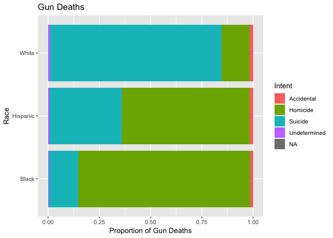
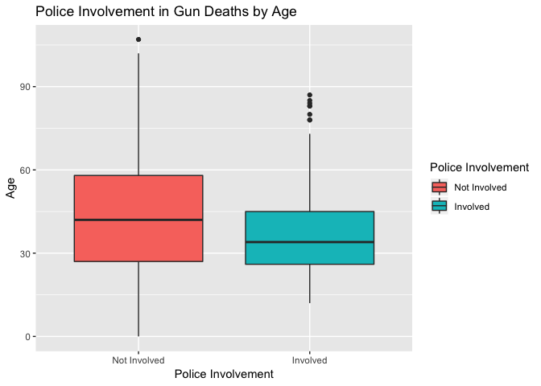

Exploring Gun Deaths in America
================
By [Jessica Robinson](https://github.com/jessrobinson42/hw01/blob/master/README.md)

Get the data
------------

``` r
library(tidyverse)    # load tidyverse packages, including ggplot2
```

    ## ── Attaching packages ─────────────────────────── tidyverse 1.2.1 ──

    ## ✔ ggplot2 3.0.0     ✔ purrr   0.2.5
    ## ✔ tibble  1.4.2     ✔ dplyr   0.7.6
    ## ✔ tidyr   0.8.1     ✔ stringr 1.3.1
    ## ✔ readr   1.1.1     ✔ forcats 0.3.0

    ## Warning: package 'dplyr' was built under R version 3.5.1

    ## ── Conflicts ────────────────────────────── tidyverse_conflicts() ──
    ## ✖ dplyr::filter() masks stats::filter()
    ## ✖ dplyr::lag()    masks stats::lag()

``` r
library(rcfss)
library(knitr)
# load the data
data("gun_deaths")
gun_deaths 
```

    ## # A tibble: 100,798 x 10
    ##       id  year month intent       police sex     age race  place education
    ##    <int> <int> <dbl> <chr>         <int> <chr> <int> <chr> <chr> <fct>    
    ##  1     1  2012     1 Suicide           0 M        34 Asia… Home  BA+      
    ##  2     2  2012     1 Suicide           0 F        21 White Stre… Some col…
    ##  3     3  2012     1 Suicide           0 M        60 White Othe… BA+      
    ##  4     4  2012     2 Suicide           0 M        64 White Home  BA+      
    ##  5     5  2012     2 Suicide           0 M        31 White Othe… HS/GED   
    ##  6     6  2012     2 Suicide           0 M        17 Nati… Home  Less tha…
    ##  7     7  2012     2 Undetermined      0 M        48 White Home  HS/GED   
    ##  8     8  2012     3 Suicide           0 M        41 Nati… Home  HS/GED   
    ##  9     9  2012     2 Accidental        0 M        50 White Othe… Some col…
    ## 10    10  2012     2 Suicide           0 M        NA Black Home  <NA>     
    ## # ... with 100,788 more rows

Generate a data frame that summarizes the number of gun deaths per month.
-------------------------------------------------------------------------

### Print the data frame as a formatted `kable()` table.

``` r
#### add months as a factor variable for label purposes 
gun_deaths <- gun_deaths %>%
  mutate(Months = factor(month, levels = seq(from = 1, to = 12), labels = month.abb))

#### create deaths per months data frame
month_death <- gun_deaths %>%
  count(Months) %>% rename("Month" = Months, "Number of Gun Deaths"= n)

#####print data frame
kable(month_death)
```

| Month |  Number of Gun Deaths|
|:------|---------------------:|
| Jan   |                  8273|
| Feb   |                  7093|
| Mar   |                  8289|
| Apr   |                  8455|
| May   |                  8669|
| Jun   |                  8677|
| Jul   |                  8989|
| Aug   |                  8783|
| Sep   |                  8508|
| Oct   |                  8406|
| Nov   |                  8243|
| Dec   |                  8413|

### Generate a bar chart with human-readable labels on the x-axis. That is, each month should be labeled "Jan", "Feb", "Mar" (full or abbreviated month names are fine), not `1`, `2`, `3`.

``` r
####plot gun deaths per month 
ggplot(gun_deaths, aes(Months, fill = Months)) +
  geom_bar() +
  labs(title = "Gun Deaths per Month",
       x = "Month",
       y = "Number of Gun Deaths") 
```


Generate a bar chart that identifies the number of gun deaths associated with each type of intent cause of death. The bars should be sorted from highest to lowest values.
--------------------------------------------------------------------------------------------------------------------------------------------------------------------------

``` r
#### plot intent in descending order 
gun_deaths %>% 
  mutate(intent = intent %>% fct_infreq()) %>%
ggplot(aes(intent, fill = intent)) +
  geom_bar() +
  labs(title = "Gun Deaths by Intent",
       x = "Type of Intent",
       y = "Number of Gun Deaths",
       fill = "Intent") 
```


Suicide is the most common form of gun death, followed by homicide.

Generate a boxplot visualizing the age of gun death victims, by sex. Print the average age of female gun death victims.
-----------------------------------------------------------------------------------------------------------------------

``` r
#####plot age of gun death victims by sex
ggplot(gun_deaths, aes(sex, age, fill = sex)) +
  geom_boxplot() +
  labs(title = "Gun Death Victim Age by Sex of Victim",
       x = "Sex of Victim",
       y = "Age of Death",
       fill = "Sex")
```

    ## Warning: Removed 18 rows containing non-finite values (stat_boxplot).


Men and women are killed at approximately the same age.

``` r
#####print mean 
kable(gun_deaths %>% filter(sex== "F")
      %>% summarise("Average Age of Female Gun Death Victims" = mean(age, na.rm=TRUE)))
```

|  Average Age of Female Gun Death Victims|
|----------------------------------------:|
|                                 43.69507|

On average, female gun deaths victims are **43.7** years old.

How many white males with at least a high school education were killed by guns in 2012?
---------------------------------------------------------------------------------------

``` r
####create filtered data frame
edwm_2012_deaths <- gun_deaths %>%
  filter(education != "Less than HS")  %>%
  filter(sex == "M")  %>%
  filter(race == "White")  %>%
  filter(year == "2012")

####print number of deaths in filtered frame 
kable(tally(edwm_2012_deaths))
```

|      n|
|------:|
|  15199|

There were **15199** white males with at least a high school education killed by guns in 2012.

Which season of the year has the most gun deaths?
-------------------------------------------------

Assume that:

-   Winter = January-March
-   Spring = April-June
-   Summer = July-September
-   Fall = October-December

``` r
#####add Seasons variable 
gun_deaths <- gun_deaths %>%
  mutate(Season = cut(month, c(0, 3, 6, 9, 12), labels = c("Winter", "Spring", "Summer", "Fall")))

####create seasons data frame 
season_death <- gun_deaths %>%
  count(Season) %>% rename("Number of Gun Deaths"= n)

####print deaths per season 
kable(season_death)
```

| Season |  Number of Gun Deaths|
|:-------|---------------------:|
| Winter |                 23655|
| Spring |                 25801|
| Summer |                 26280|
| Fall   |                 25062|

``` r
###plot gun deaths by season 
ggplot(gun_deaths, aes(Season, fill = Season)) +
  geom_bar() +
  labs(title = "Gun Deaths per Season",
       x = "Season",
       y = "Number of Gun Deaths")
```


Are whites who are killed by guns more likely to die because of suicide or homicide? How does this compare to blacks and hispanics?
===================================================================================================================================

``` r
####create data frame with just "White"", "Black, "Hispanic"
rda <- gun_deaths %>% 
  filter(race != "Asian/Pacific Islander") 
race_deaths <- rda %>% 
  filter(race != "Native American/Native Alaskan")

####plot gun deaths by intent and race 
ggplot(race_deaths, aes(x = race, fill = intent)) + 
  geom_bar(position = "fill") + coord_flip() + 
  labs(title = "Gun Deaths",
       x = "Race",
       y = "Proportion",
       fill = "Intent")
```



White are more likely to die by because suicide than homicide. In comparison, blacks and hispanics are both more likely to die by homicide than suicide.

Are police-involved gun deaths significantly different from other gun deaths? Assess the relationship between police involvement and age, police involvement and race, and the intersection of all three variables.
-------------------------------------------------------------------------------------------------------------------------------------------------------------------------------------------------------------------

``` r
####mutate police involvement into factor
gun_deaths <- gun_deaths %>% mutate(PolInv = factor(police, labels = c("Not Involved", "Involved")))


####plot police vs. race
ggplot(gun_deaths, aes(x = PolInv, fill = race)) +
       geom_bar(position = "fill") +
        labs(title = "Police Involvement in Gun Deaths by Race",
       x = "Police Involvement",
       y = "Proportion",
       fill = "Race")
```


``` r
####plot police vs. age 
ggplot(gun_deaths, aes(x = PolInv, y = age, fill = PolInv)) +
       geom_boxplot() +
 labs(title = "Police Involvement in Gun Deaths by Age",
       x = "Police Involvement",
       y = "Age",
      fill = "Police Involvement"
        )
```

    ## Warning: Removed 18 rows containing non-finite values (stat_boxplot).



``` r
####plot police, age, race
ggplot(gun_deaths, aes(x = race, y = age, fill = PolInv)) +
       geom_boxplot() +
  coord_flip() + 
 labs(title = "Police Involvement in Gun Deaths by Race and Age",
       x = "Race",
       y = "Age",
      fill = "Police Involvement"  )
```

    ## Warning: Removed 18 rows containing non-finite values (stat_boxplot).


Session info
------------

``` r
# don't modify this chunk
devtools::session_info()
```

    ## ─ Session info ──────────────────────────────────────────────────────────
    ##  setting  value                       
    ##  version  R version 3.5.0 (2018-04-23)
    ##  os       OS X El Capitan 10.11.6     
    ##  system   x86_64, darwin15.6.0        
    ##  ui       X11                         
    ##  language (EN)                        
    ##  collate  en_US.UTF-8                 
    ##  ctype    en_US.UTF-8                 
    ##  tz       America/Chicago             
    ##  date     2019-04-14                  
    ## 
    ## ─ Packages ──────────────────────────────────────────────────────────────
    ##  package     * version date       lib source                        
    ##  assertthat    0.2.0   2017-04-11 [1] CRAN (R 3.5.0)                
    ##  backports     1.1.2   2017-12-13 [1] CRAN (R 3.5.0)                
    ##  base64enc     0.1-3   2015-07-28 [1] CRAN (R 3.5.0)                
    ##  bindr         0.1.1   2018-03-13 [1] CRAN (R 3.5.0)                
    ##  bindrcpp    * 0.2.2   2018-03-29 [1] CRAN (R 3.5.0)                
    ##  broom         0.5.0   2018-07-17 [1] CRAN (R 3.5.0)                
    ##  callr         3.0.0   2018-08-24 [1] CRAN (R 3.5.0)                
    ##  cellranger    1.1.0   2016-07-27 [1] CRAN (R 3.5.0)                
    ##  cli           1.0.0   2017-11-05 [1] CRAN (R 3.5.0)                
    ##  colorspace    1.3-2   2016-12-14 [1] CRAN (R 3.5.0)                
    ##  crayon        1.3.4   2017-09-16 [1] CRAN (R 3.5.0)                
    ##  desc          1.2.0   2018-05-01 [1] CRAN (R 3.5.0)                
    ##  devtools      2.0.1   2018-10-26 [1] CRAN (R 3.5.0)                
    ##  digest        0.6.15  2018-01-28 [1] CRAN (R 3.5.0)                
    ##  dplyr       * 0.7.6   2018-06-29 [1] CRAN (R 3.5.1)                
    ##  evaluate      0.10.1  2017-06-24 [1] CRAN (R 3.5.0)                
    ##  forcats     * 0.3.0   2018-02-19 [1] CRAN (R 3.5.0)                
    ##  fs            1.2.6   2018-08-23 [1] CRAN (R 3.5.0)                
    ##  ggplot2     * 3.0.0   2018-07-03 [1] CRAN (R 3.5.0)                
    ##  glue          1.2.0   2017-10-29 [1] CRAN (R 3.5.0)                
    ##  gtable        0.2.0   2016-02-26 [1] CRAN (R 3.5.0)                
    ##  haven         1.1.2   2018-06-27 [1] CRAN (R 3.5.0)                
    ##  highr         0.7     2018-06-09 [1] CRAN (R 3.5.0)                
    ##  hms           0.4.2   2018-03-10 [1] CRAN (R 3.5.0)                
    ##  htmltools     0.3.6   2017-04-28 [1] CRAN (R 3.5.0)                
    ##  httr          1.3.1   2017-08-20 [1] CRAN (R 3.5.0)                
    ##  jsonlite      1.5     2017-06-01 [1] CRAN (R 3.5.0)                
    ##  knitr       * 1.20    2018-02-20 [1] CRAN (R 3.5.0)                
    ##  labeling      0.3     2014-08-23 [1] CRAN (R 3.5.0)                
    ##  lattice       0.20-35 2017-03-25 [1] CRAN (R 3.5.0)                
    ##  lazyeval      0.2.1   2017-10-29 [1] CRAN (R 3.5.0)                
    ##  lubridate     1.7.4   2018-04-11 [1] CRAN (R 3.5.0)                
    ##  magrittr      1.5     2014-11-22 [1] CRAN (R 3.5.0)                
    ##  memoise       1.1.0   2017-04-21 [1] CRAN (R 3.5.0)                
    ##  modelr        0.1.2   2018-05-11 [1] CRAN (R 3.5.0)                
    ##  munsell       0.5.0   2018-06-12 [1] CRAN (R 3.5.0)                
    ##  nlme          3.1-137 2018-04-07 [1] CRAN (R 3.5.0)                
    ##  pillar        1.2.3   2018-05-25 [1] CRAN (R 3.5.0)                
    ##  pkgbuild      1.0.2   2018-10-16 [1] CRAN (R 3.5.0)                
    ##  pkgconfig     2.0.1   2017-03-21 [1] CRAN (R 3.5.0)                
    ##  pkgload       1.0.2   2018-10-29 [1] CRAN (R 3.5.0)                
    ##  plyr          1.8.4   2016-06-08 [1] CRAN (R 3.5.0)                
    ##  prettyunits   1.0.2   2015-07-13 [1] CRAN (R 3.5.0)                
    ##  processx      3.2.0   2018-08-16 [1] CRAN (R 3.5.0)                
    ##  ps            1.1.0   2018-08-10 [1] CRAN (R 3.5.0)                
    ##  purrr       * 0.2.5   2018-05-29 [1] CRAN (R 3.5.0)                
    ##  R6            2.2.2   2017-06-17 [1] CRAN (R 3.5.0)                
    ##  rcfss       * 0.1.5   2019-04-08 [1] Github (uc-cfss/rcfss@90a1b9d)
    ##  Rcpp          0.12.17 2018-05-18 [1] CRAN (R 3.5.0)                
    ##  readr       * 1.1.1   2017-05-16 [1] CRAN (R 3.5.0)                
    ##  readxl        1.1.0   2018-04-20 [1] CRAN (R 3.5.0)                
    ##  remotes       2.0.2   2018-10-30 [1] CRAN (R 3.5.0)                
    ##  rlang         0.3.0.1 2018-10-25 [1] CRAN (R 3.5.0)                
    ##  rmarkdown     1.10    2018-06-11 [1] CRAN (R 3.5.0)                
    ##  rprojroot     1.3-2   2018-01-03 [1] CRAN (R 3.5.0)                
    ##  rstudioapi    0.8     2018-10-02 [1] CRAN (R 3.5.0)                
    ##  rvest         0.3.2   2016-06-17 [1] CRAN (R 3.5.0)                
    ##  scales        0.5.0   2017-08-24 [1] CRAN (R 3.5.0)                
    ##  sessioninfo   1.1.1   2018-11-05 [1] CRAN (R 3.5.0)                
    ##  stringi       1.2.3   2018-06-12 [1] CRAN (R 3.5.0)                
    ##  stringr     * 1.3.1   2018-05-10 [1] CRAN (R 3.5.0)                
    ##  testthat      2.0.0   2017-12-13 [1] CRAN (R 3.5.0)                
    ##  tibble      * 1.4.2   2018-01-22 [1] CRAN (R 3.5.0)                
    ##  tidyr       * 0.8.1   2018-05-18 [1] CRAN (R 3.5.0)                
    ##  tidyselect    0.2.4   2018-02-26 [1] CRAN (R 3.5.0)                
    ##  tidyverse   * 1.2.1   2017-11-14 [1] CRAN (R 3.5.0)                
    ##  usethis       1.4.0   2018-08-14 [1] CRAN (R 3.5.0)                
    ##  utf8          1.1.4   2018-05-24 [1] CRAN (R 3.5.0)                
    ##  withr         2.1.2   2018-03-15 [1] CRAN (R 3.5.0)                
    ##  xml2          1.2.0   2018-01-24 [1] CRAN (R 3.5.0)                
    ##  yaml          2.1.19  2018-05-01 [1] CRAN (R 3.5.0)                
    ## 
    ## [1] /Library/Frameworks/R.framework/Versions/3.5/Resources/library
